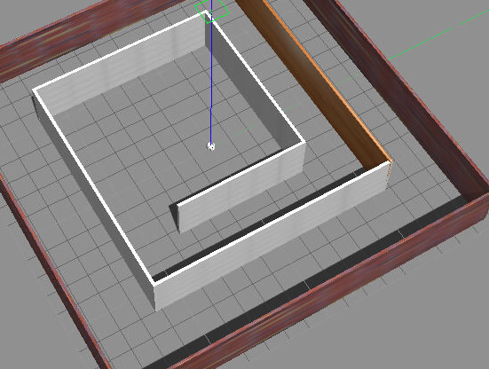
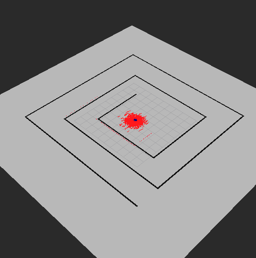
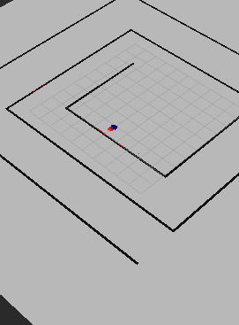

# Where am I with 

Using Adaptive Monte Carlo Localization package with odometry and radar data to localize the robot

Compile the package

`catkin_make`

Launch the robot:

`roslaunch my_robot world.launch`

Lo move the robot:

`rosrun teleop_twist_keyboard teleop_twist_keyboard.py`

---

### Images of the Gazebo and Rviz with the Robot:

#### The gazebo world 
(with the robot in the middle)

---

#### Before moving the robot:

--- 
### After moving the robot:

In the two images above we can see how the particles converge to where the robot is localized after moving it. The model clearly is discarding the inaccurate once.

