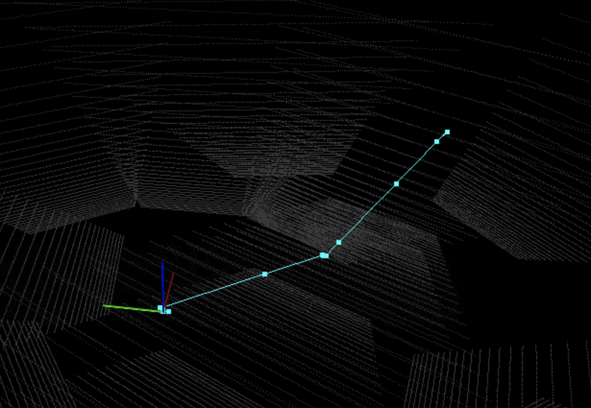

# Where am I with 

Using Adaptive Monte Carlo Localization package with odometry and radar data to localize the robot

Compile the package

`catkin_make`

Launch the robot:

`roslaunch my_robot world.launch`

Lo move the robot:

`rosrun teleop_twist_keyboard teleop_twist_keyboard.py`

---

### Images of the rtab mapping:

---

The mapping data base is under `assets/rtabmap.db`

